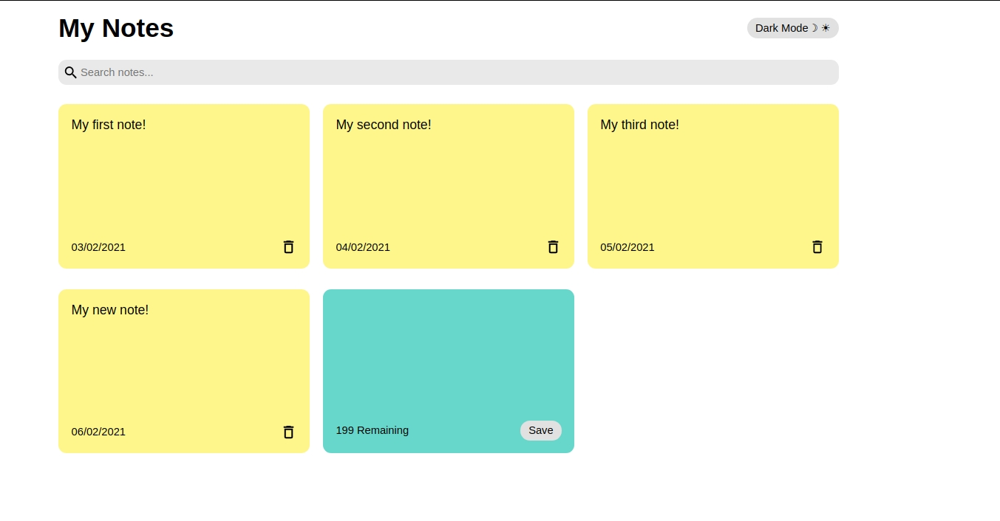
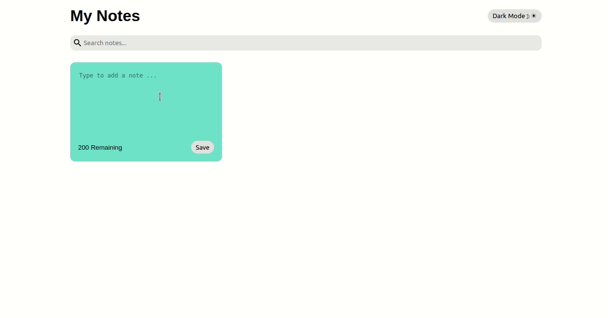

# My Note App

### Manage your notes. Add, view, search or delete them easily.

# 🎨 Layout

<div align="center">
  <p align="center">
    
  </p>
</div>

<br>

# 📽️ Demo

<div align="center">
  <p align="center">
    
  </p>
</div>

<br>

# 🚀  Tecnologies

- [ReactJS](https://reactjs.org/)
- [React Icons](https://react-icons.github.io/react-icons/)
- [JavaScript](https://www.typescriptlang.org/)
<br>

# 🔧 Run Locally

Clone the project

```bash
  git clone git@github.com:Joseane-Guedes/my-notes-app.git
```

Go to the project directory

```bash
  cd my-notes-app.git
```

Install dependencies

```bash
  yarn
```

Start the server

```bash
  yarn start
```

# 📚​License

Released in 2021 📚​. License

This project is under the [MIT license](./LICENSE).

#

<!-- <p align="center">
   <b> &#60;/&#62; by <a href="https://www.linkedin.com/in/joseane-guedes/">Joseane Guedes</a></b>
</p> -->

Made with  ❤️ by [Joseane Guedes ](https://github.com/Joseane-Guedes) 
